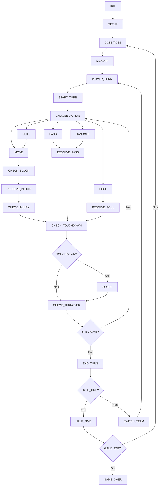
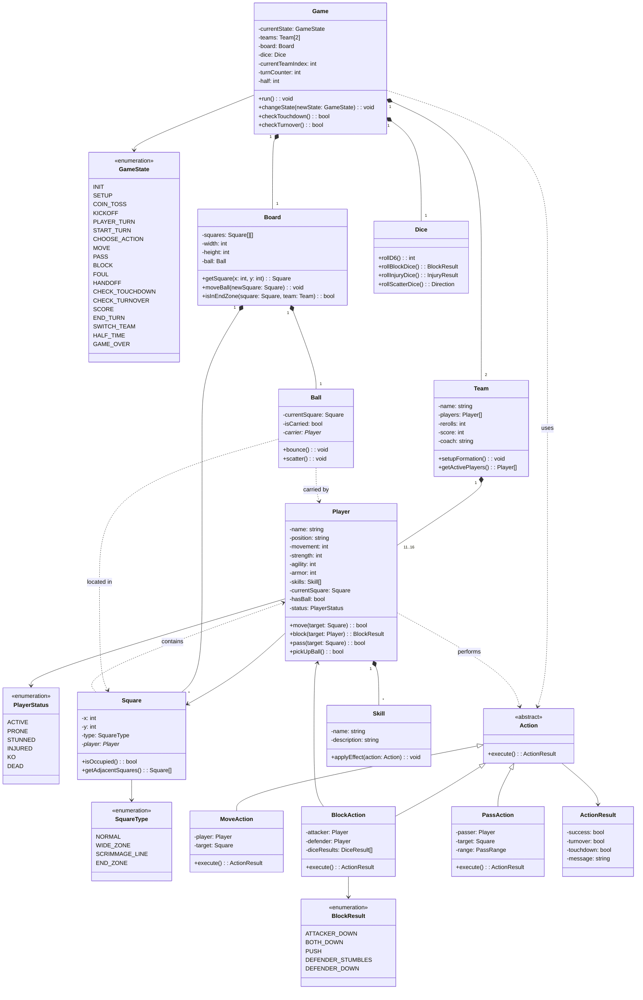

# PLT

## Proposiiton de FSM:

```mermaid
graph TD
    A[INIT] --> B[SETUP]
    B --> C[COIN_TOSS]
    C --> D[KICKOFF]
    D --> E[PLAYER_TURN]
    E --> F[START_TURN]
    F --> G[CHOOSE_ACTION]

    G --> H[MOVE]
    H --> I[CHECK_BLOCK]
    I --> J[RESOLVE_BLOCK]
    J --> K[CHECK_INJURY]
    K --> L[CHECK_TOUCHDOWN]
    
    G --> M[PASS]
    M --> N[RESOLVE_PASS]
    N --> L
    
    G --> O[FOUL]
    O --> P[RESOLVE_FOUL]
    P --> L
    
    G --> Q[BLITZ]
    Q --> H
    
    G --> R[HANDOFF]
    R --> N
    
    L --> S{TOUCHDOWN?}
    S -->|Oui| T[SCORE]
    S -->|Non| U[CHECK_TURNOVER]
    
    T --> U
    
    U --> V{TURNOVER?}
    V -->|Oui| W[END_TURN]
    V -->|Non| G
    
    W --> X{HALF_TIME?}
    X -->|Oui| Y[HALF_TIME]
    X -->|Non| Z[SWITCH_TEAM]
    
    Y --> AA{GAME_END?}
    AA -->|Non| C
    AA -->|Oui| AB[GAME_OVER]
    
    Z --> E
```

## Proposition de diagramme de classe:

```mermaid
classDiagram
    %% Classes principales du jeu
    class Game {
        -currentState: GameState
        -teams: Team[2]
        -board: Board
        -dice: Dice
        -currentTeamIndex: int
        -turnCounter: int
        -half: int
        +run(): void
        +changeState(newState: GameState): void
        +checkTouchdown(): bool
        +checkTurnover(): bool
    }

    class GameState {
        <<enumeration>>
        INIT
        SETUP
        COIN_TOSS
        KICKOFF
        PLAYER_TURN
        START_TURN
        CHOOSE_ACTION
        MOVE
        PASS
        BLOCK
        FOUL
        HANDOFF
        CHECK_TOUCHDOWN
        CHECK_TURNOVER
        SCORE
        END_TURN
        SWITCH_TEAM
        HALF_TIME
        GAME_OVER
    }

    class Team {
        -name: string
        -players: Player[]
        -rerolls: int
        -score: int
        -coach: string
        +setupFormation(): void
        +getActivePlayers(): Player[]
    }

    class Player {
        -name: string
        -position: string
        -movement: int
        -strength: int
        -agility: int
        -armor: int
        -skills: Skill[]
        -currentSquare: Square
        -hasBall: bool
        -status: PlayerStatus
        +move(target: Square): bool
        +block(target: Player): BlockResult
        +pass(target: Square): bool
        +pickUpBall(): bool
    }

    class PlayerStatus {
        <<enumeration>>
        ACTIVE
        PRONE
        STUNNED
        INJURED
        KO
        DEAD
    }

    class Board {
        -squares: Square[][]
        -width: int
        -height: int
        -ball: Ball
        +getSquare(x: int, y: int): Square
        +moveBall(newSquare: Square): void
        +isInEndZone(square: Square, team: Team): bool
    }

    class Square {
        -x: int
        -y: int
        -type: SquareType
        -player: Player*
        +isOccupied(): bool
        +getAdjacentSquares(): Square[]
    }

    class SquareType {
        <<enumeration>>
        NORMAL
        WIDE_ZONE
        SCRIMMAGE_LINE
        END_ZONE
    }

    class Ball {
        -currentSquare: Square
        -isCarried: bool
        -carrier: Player*
        +bounce(): void
        +scatter(): void
    }

    class Action {
        <<abstract>>
        +execute(): ActionResult
    }

    class MoveAction {
        -player: Player
        -target: Square
        +execute(): ActionResult
    }

    class BlockAction {
        -attacker: Player
        -defender: Player
        -diceResults: DiceResult[]
        +execute(): ActionResult
    }

    class PassAction {
        -passer: Player
        -target: Square
        -range: PassRange
        +execute(): ActionResult
    }

    class ActionResult {
        -success: bool
        -turnover: bool
        -touchdown: bool
        -message: string
    }

    class Dice {
        +rollD6(): int
        +rollBlockDice(): BlockResult
        +rollInjuryDice(): InjuryResult
        +rollScatterDice(): Direction
    }

    class BlockResult {
        <<enumeration>>
        ATTACKER_DOWN
        BOTH_DOWN
        PUSH
        DEFENDER_STUMBLES
        DEFENDER_DOWN
    }

    class Skill {
        -name: string
        -description: string
        +applyEffect(action: Action): void
    }

    %% Relations entre classes
    Game --> GameState
    Game "1" *-- "2" Team
    Game "1" *-- "1" Board
    Game "1" *-- "1" Dice
    
    Team "1" *-- "11..16" Player
    Player --> PlayerStatus
    Player "1" *-- "*" Skill
    Player --> Square
    
    Board "1" *-- "*" Square
    Board "1" *-- "1" Ball
    Square --> SquareType
    
    Action <|-- MoveAction
    Action <|-- BlockAction
    Action <|-- PassAction
    Action --> ActionResult
    
    BlockAction --> BlockResult
    BlockAction --> Player

    %% Relations d'association
    Game ..> Action : uses
    Player ..> Action : performs
    Square ..> Player : contains
    Ball ..> Player : carried by
    Ball ..> Square : located in
```
