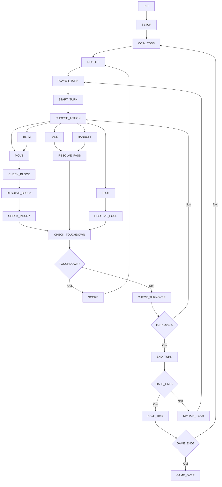
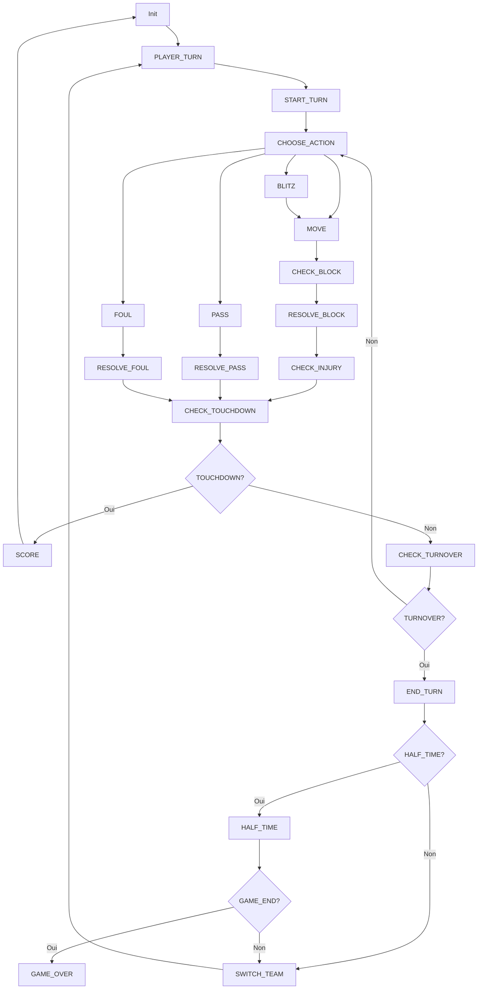
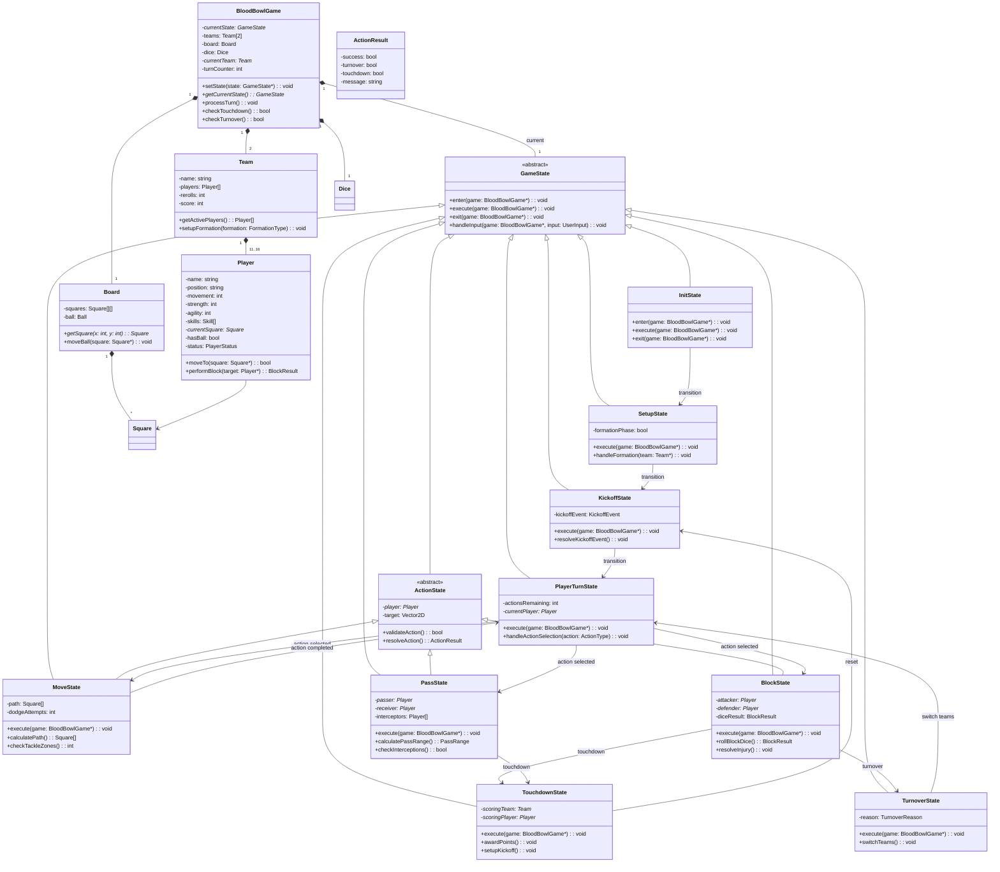

## Proposiiton de FSM v1:

```mermaid
graph TD
    A[INIT] --> B[SETUP]
    B --> C[COIN_TOSS]
    C --> D[KICKOFF]
    D --> E[PLAYER_TURN]
    E --> F[START_TURN]
    F --> G[CHOOSE_ACTION]

    G --> H[MOVE]
    H --> I[CHECK_BLOCK]
    I --> J[RESOLVE_BLOCK]
    J --> K[CHECK_INJURY]
    K --> L[CHECK_TOUCHDOWN]
    
    G --> M[PASS]
    M --> N[RESOLVE_PASS]
    N --> L
    
    G --> O[FOUL]
    O --> P[RESOLVE_FOUL]
    P --> L
    
    G --> Q[BLITZ]
    Q --> H
    
    G --> R[HANDOFF]
    R --> N
    
    L --> S{TOUCHDOWN?}
    S -->|Oui| T[SCORE]
    S -->|Non| U[CHECK_TURNOVER]
    
    T --> D
    
    U --> V{TURNOVER?}
    V -->|Oui| W[END_TURN]
    V -->|Non| G
    
    W --> X{HALF_TIME?}
    X -->|Oui| Y[HALF_TIME]
    X -->|Non| Z[SWITCH_TEAM]
    
    Y --> AA{GAME_END?}
    AA -->|Non| C
    AA -->|Oui| AB[GAME_OVER]
    
    Z --> E
```

## Proposiiton de FSM v2:

```mermaid
graph TD
    A[Init] --> E[PLAYER_TURN]
    E --> F[START_TURN]
    F --> G[CHOOSE_ACTION]

    G --> H[MOVE]
    H --> I[CHECK_BLOCK]
    I --> J[RESOLVE_BLOCK]
    J --> K[CHECK_INJURY]
    K --> L[CHECK_TOUCHDOWN]
    
    G --> M[PASS]
    M --> N[RESOLVE_PASS]
    N --> L
    
    G --> O[FOUL]
    O --> P[RESOLVE_FOUL]
    P --> L
    
    G --> Q[BLITZ]
    Q --> H
    
    L --> S{TOUCHDOWN?}
    S -->|Oui| T[SCORE]
    S -->|Non| U[CHECK_TURNOVER]
    
    T --> A
    
    U --> V{TURNOVER?}
    V -->|Oui| W[END_TURN]
    V -->|Non| G
    
    W --> X{HALF_TIME?}
    X -->|Oui| Y[HALF_TIME]
    X -->|Non| Z[SWITCH_TEAM]
    
    Y --> AA{GAME_END?}
    AA -->|Non| Z
    AA -->|Oui| AB[GAME_OVER]
    
    Z --> E
```

## Proposition de diagramme de classe:

```mermaid
classDiagram
    %% Classe principale du jeu
    class BloodBowlGame {
        -currentState: GameState*
        -teams: Team[2]
        -board: Board
        -dice: Dice
        -currentTeam: Team*
        -turnCounter: int
        +setState(state: GameState*): void
        +getCurrentState(): GameState*
        +processTurn(): void
        +checkTouchdown(): bool
        +checkTurnover(): bool
    }

    %% Interface State de base
    class GameState {
        <<abstract>>
        +enter(game: BloodBowlGame*): void
        +execute(game: BloodBowlGame*): void
        +exit(game: BloodBowlGame*): void
        +handleInput(game: BloodBowlGame*, input: UserInput): void
    }

    %% États concrets de la FSM
    class InitState {
        +enter(game: BloodBowlGame*): void
        +execute(game: BloodBowlGame*): void
        +exit(game: BloodBowlGame*): void
    }

    class SetupState {
        -formationPhase: bool
        +execute(game: BloodBowlGame*): void
        +handleFormation(team: Team*): void
    }

    class PlayerTurnState {
        -actionsRemaining: int
        -currentPlayer: Player*
        +execute(game: BloodBowlGame*): void
        +handleActionSelection(action: ActionType): void
    }

    class ActionState {
        <<abstract>>
        -player: Player*
        -target: Vector2D
        +validateAction(): bool
        +resolveAction(): ActionResult
    }

    class MoveState {
        -path: Square[]
        -dodgeAttempts: int
        +execute(game: BloodBowlGame*): void
        +calculatePath(): Square[]
        +checkTackleZones(): int
    }

    class BlockState {
        -attacker: Player*
        -defender: Player*
        -diceResult: BlockResult
        +execute(game: BloodBowlGame*): void
        +rollBlockDice(): BlockResult
        +resolveInjury(): void
    }

    class PassState {
        -passer: Player*
        -receiver: Player*
        -interceptors: Player[]
        +execute(game: BloodBowlGame*): void
        +calculatePassRange(): PassRange
        +checkInterceptions(): bool
    }

    class TouchdownState {
        -scoringTeam: Team*
        -scoringPlayer: Player*
        +execute(game: BloodBowlGame*): void
        +awardPoints(): void
        +setupKickoff(): void
    }

    class TurnoverState {
        -reason: TurnoverReason
        +execute(game: BloodBowlGame*): void
        +switchTeams(): void
    }

    class KickoffState {
        -kickoffEvent: KickoffEvent
        +execute(game: BloodBowlGame*): void
        +resolveKickoffEvent(): void
    }

    %% Classes support
    class Team {
        -name: string
        -players: Player[]
        -rerolls: int
        -score: int
        +getActivePlayers(): Player[]
        +setupFormation(formation: FormationType): void
    }

    class Player {
        -name: string
        -position: string
        -movement: int
        -strength: int
        -agility: int
        -skills: Skill[]
        -currentSquare: Square*
        -hasBall: bool
        -status: PlayerStatus
        +moveTo(square: Square*): bool
        +performBlock(target: Player*): BlockResult
    }

    class Board {
        -squares: Square[][]
        -ball: Ball
        +getSquare(x: int, y: int): Square*
        +moveBall(square: Square*): void
    }

    class ActionResult {
        -success: bool
        -turnover: bool
        -touchdown: bool
        -message: string
    }

    %% Relations
    BloodBowlGame "1" *-- "1" GameState : current
    BloodBowlGame "1" *-- "2" Team
    BloodBowlGame "1" *-- "1" Board
    BloodBowlGame "1" *-- "1" Dice

    GameState <|-- InitState
    GameState <|-- SetupState
    GameState <|-- PlayerTurnState
    GameState <|-- ActionState
    GameState <|-- MoveState
    GameState <|-- BlockState
    GameState <|-- PassState
    GameState <|-- TouchdownState
    GameState <|-- TurnoverState
    GameState <|-- KickoffState

    ActionState <|-- MoveState
    ActionState <|-- BlockState
    ActionState <|-- PassState

    Team "1" *-- "11..16" Player
    Board "1" *-- "*" Square
    Player --> Square

    %% Transitions entre états
    InitState --> SetupState : transition
    SetupState --> KickoffState : transition
    KickoffState --> PlayerTurnState : transition
    PlayerTurnState --> MoveState : action selected
    PlayerTurnState --> BlockState : action selected
    PlayerTurnState --> PassState : action selected
    MoveState --> PlayerTurnState : action completed
    BlockState --> TouchdownState : touchdown
    BlockState --> TurnoverState : turnover
    PassState --> TouchdownState : touchdown
    TouchdownState --> KickoffState : reset
    TurnoverState --> PlayerTurnState : switch teams
```
