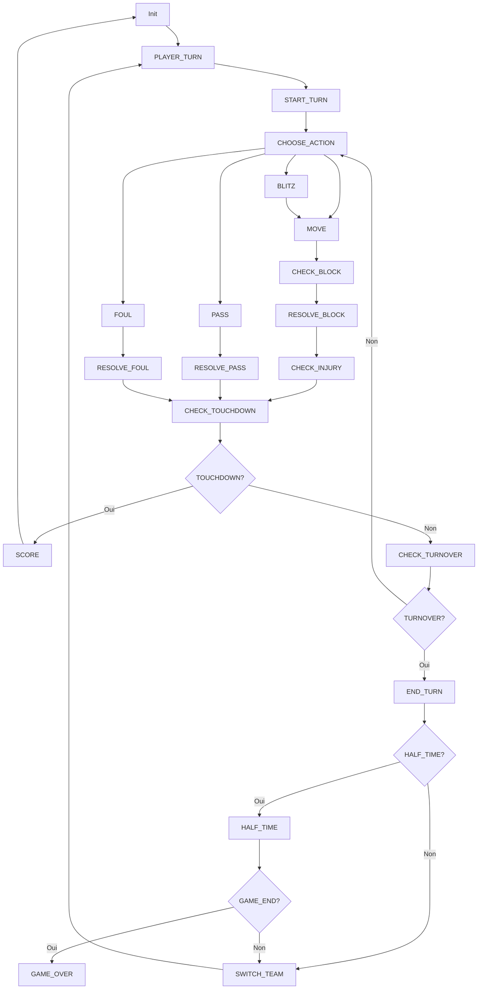

## Proposition de FSM v2:



## Etat Actuel de la FSM:

```mermaid
graph TD
    Setup[Setup] --> |SetupEnded == TRUE| Kickoff[Kickoff]
    Kickoff --> PlayerTurn[Player Turn]
    PlayerTurn --> | EndTurn or TrunOver or Touchdown == TRUE| PlayerTurn
    PlayerTurn --> |TurnCounter == 16| HalfTime[Half Time]
    PlayerTurn --> |TurnCounter == 32| EndGame[EndGame]
    HalfTime --> Setup
    EndGame --> |restart == TRUE| Setup